# 🚗 Car Dealership Inventory System

A production-ready full-stack vehicle inventory management system built using **FastAPI**, **React 19**, **PostgreSQL (Neon)** and **JWT Authentication**, following a strict **Test-Driven Development (TDD)** workflow.


---

## 🎥 Live Demo

- **Live Application:** [https://srs-dealership.vercel.app](https://srs-dealership.vercel.app)
- **Backend API:** [https://drivehub-dealership.onrender.com](https://drivehub-dealership.onrender.com)
- **Video Walkthrough (2–3 minutes):** [https://drive.google.com/file/d/1DKW8sRqNYMx0oeQTn5PxvSK0mQPkqPs7/view?usp=drive_link](https://drive.google.com/file/d/1tpiJn5c21oQO9OwF0w10JjRMPwBev-ja/view?usp=sharing)
- **Live Cloud Database:** **Neon Serverless PostgreSQL** (51 vehicles seeded + demo accounts)

### 🔑 Demo Credentials
- **Administrator**: `admin@dealership.com` (`admin123`)
- **Regular Customer**: `user@dealership.com` (`user123`)

---

## ✨ Key Features

- **Permission-Gated Single-Page Dashboard**: Customers and administrators share the same single-page dashboard. Controls render dynamically based on `user.role` from `AuthContext`.
- **JWT Authentication & Security**: Password hashing with `bcrypt`, token expiration, and role authorization.
- **Dedicated Search & Filter Bar**: Sleek dark glassmorphism card featuring Maker/Brand, Model, Category, Year, Sort By, and an indigo/blue **Filter & Sort** action button.
- **Brand-Grouped Admin Inventory Controls**: For administrators, clicking **`Manage Inventory`** opens a dedicated inventory management view grouping vehicles by their Brand/Maker (e.g., `Mercedes-Benz`, `Honda`, `BMW`, `Audi`, `Toyota`, etc.), complete with stock summaries and inline `Edit`, `Restock`, and `Delete` action controls.
- **Dynamic E-Commerce Catalog Metrics Banner**: Real-time stats header displaying total Brands, Vehicle Models, and Categories (`Browse among X Brands in Y Vehicles across Z Categories`).
- **Role-Based Permissions**:
  - `user` (Customer): Browse inventory, live search across maker/model, filter by category/price range, purchase vehicles, view personal purchase history in profile.
  - `admin` (Administrator): All customer capabilities + **`Manage Inventory`** view toggle, `+ Add New Vehicle` modal, vehicle editing, stock restocking, and deletion with confirmation.
- **INR Currency Formatting**: All vehicle prices formatted in **INR (₹)** with Lakhs/Crores grouping logic (`Intl.NumberFormat('en-IN')`).
- **Client-Side Vehicle Sorting**: Interactive sorting dropdown by price (Low to High, High to Low), year, and model name.
- **Purchase Checkout & History Module**: Interactive checkout modal taking buyer details (`buyer_name`, `buyer_phone`, `delivery_address`, `note`), price snapshotting (`price_at_purchase`), and purchase history log accessible via profile.
- **Real-Time Inventory Protection**: Stock depletion guard (`quantity >= 0`), greyed-out disabled Purchase buttons when out-of-stock (`quantity == 0`), and database-level `CHECK` constraints.
- **Automated Secret Scanning**: Local Git pre-commit scanner hook preventing secret/key exposure.
- **Full Mobile Responsiveness**: Mobile-friendly hamburger navigation drawer and responsive grid layouts.

---

## 📸 Application Screenshots

A walkthrough of the live production app ([srs-dealership.vercel.app](https://srs-dealership.vercel.app)), from a guest's first visit through customer purchase flow and admin inventory management.

### Guest Access & Authentication

| | |
| :---: | :---: |
| 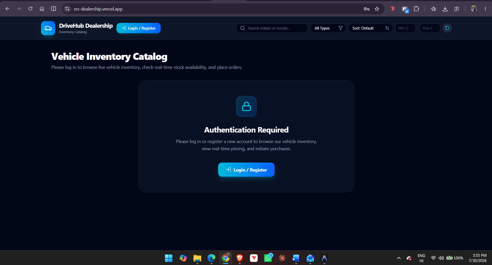 | 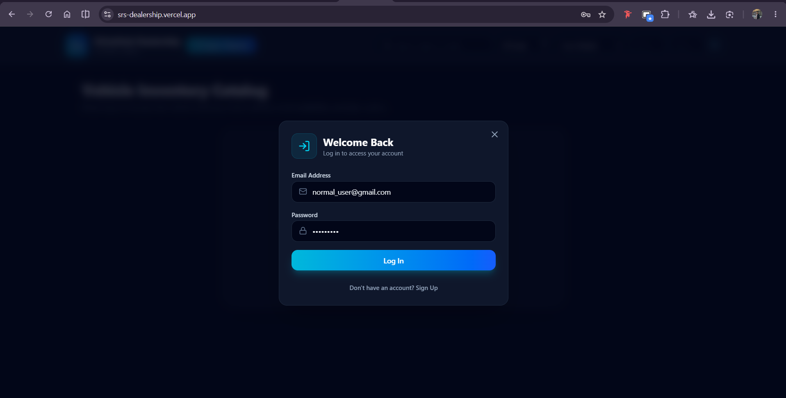 |
| **Guarded Dashboard (Guest State)** — Before logging in, the catalog is locked behind an "Authentication Required" panel. Guests see the `Login / Register` control in the navbar but no vehicle data, pricing, or search is exposed until authenticated. | **Login Modal** — The "Welcome Back" login form, here mid-entry with the demo customer account (`user@dealership.com`). |

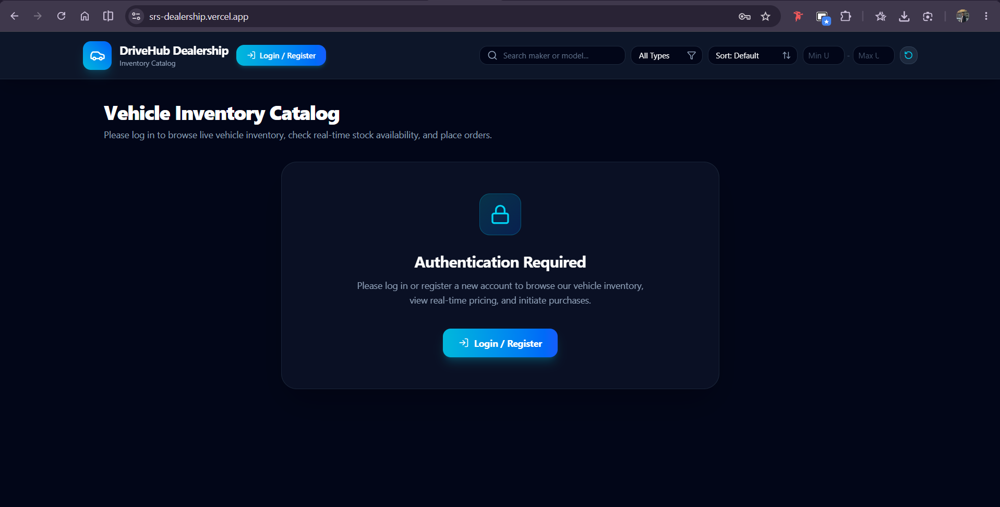

*The same locked catalog state shown again immediately before login — confirming no vehicle cards, prices, or filters render for unauthenticated visitors.*

### Customer Experience

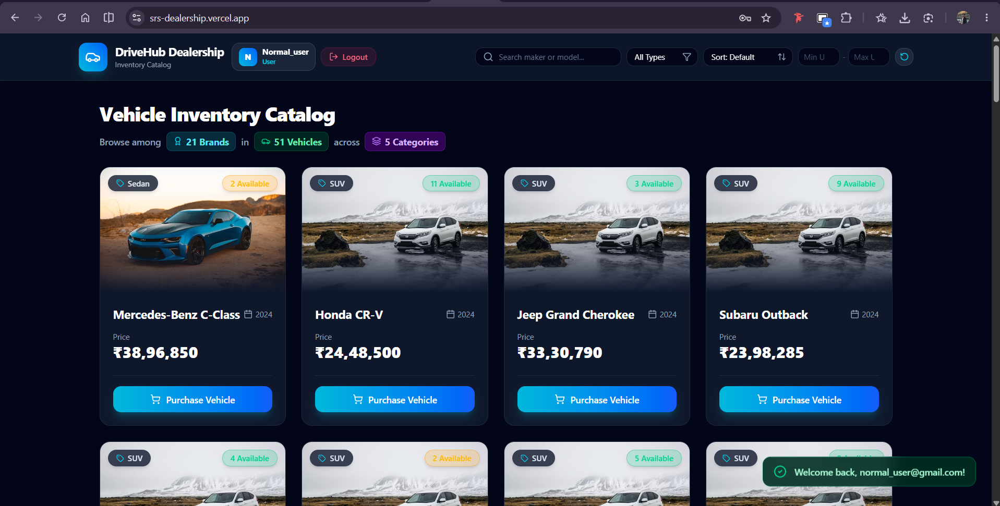

**Customer Dashboard (Logged In as Customer)** — Once authenticated, the full Vehicle Inventory Catalog unlocks: the stats banner ("Browse among Brands, Vehicles, and Categories"), live search/filter/sort controls, and a grid of vehicle cards with INR-formatted pricing and stock-availability pills. Regular users see only a **Purchase Vehicle** button per card — no Edit, Delete, or Restock controls, since those are admin-gated.

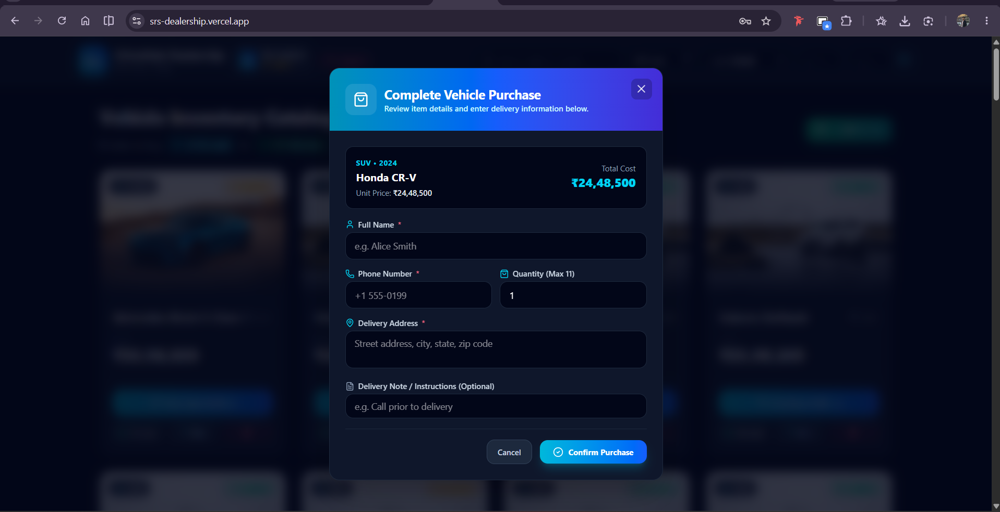

**Purchase Checkout Modal** — Clicking "Purchase Vehicle" opens the checkout form, showing the selected vehicle's unit price and total cost, with fields for full name, phone number, quantity (capped at available stock), delivery address, and an optional delivery note. Submitting calls `POST /api/vehicles/{id}/purchase`, which snapshots `price_at_purchase` and decrements stock.

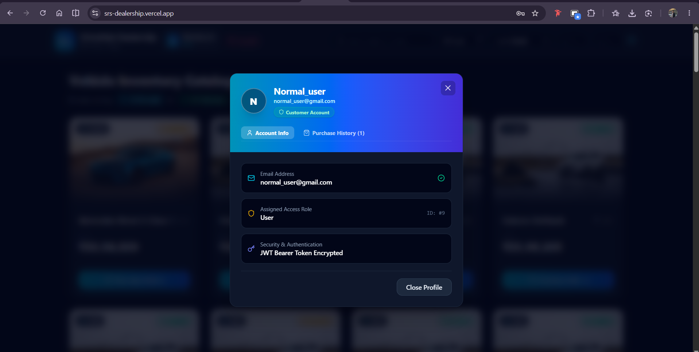

**Profile Modal — Purchase History** — The account profile shows the logged-in user's email, assigned role (`User`), and security status, alongside an **Account Info** / **Purchase History** tab toggle so customers can review their own past orders in isolation from other users.

### Administrator Experience

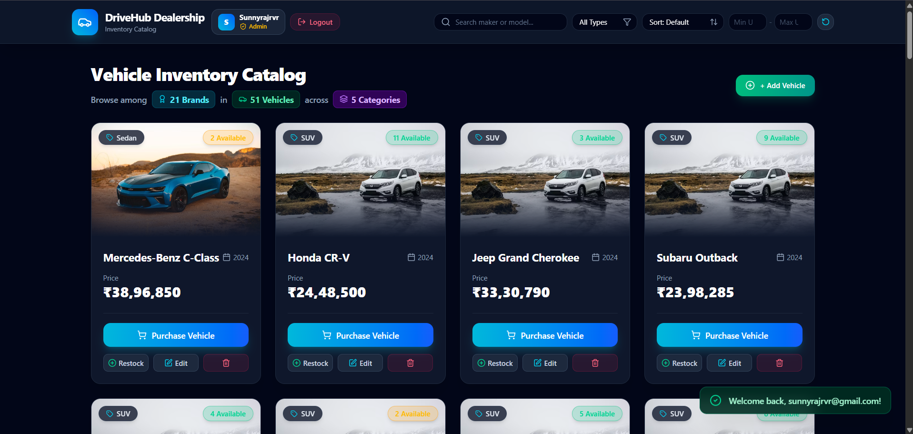

**Admin Dashboard (Logged In as Admin)** — The same catalog view, but with elevated permissions rendered dynamically from `user.role`: a **+ Add Vehicle** action above the grid, and per-card **Restock**, **Edit**, and **Delete** controls that are completely absent from the customer view above.

| | |
| :---: | :---: |
| 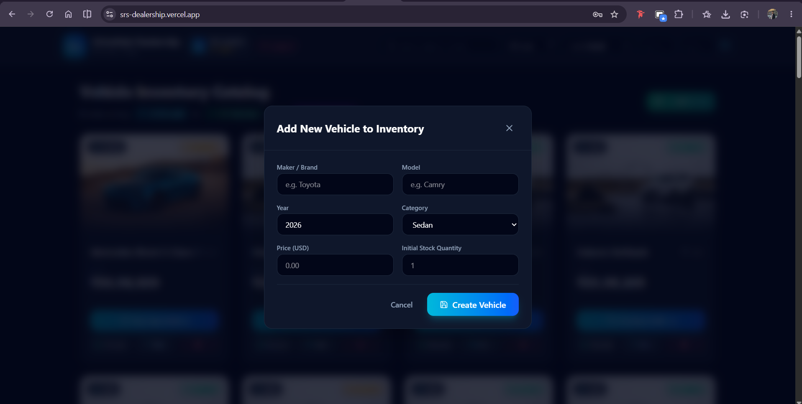 | 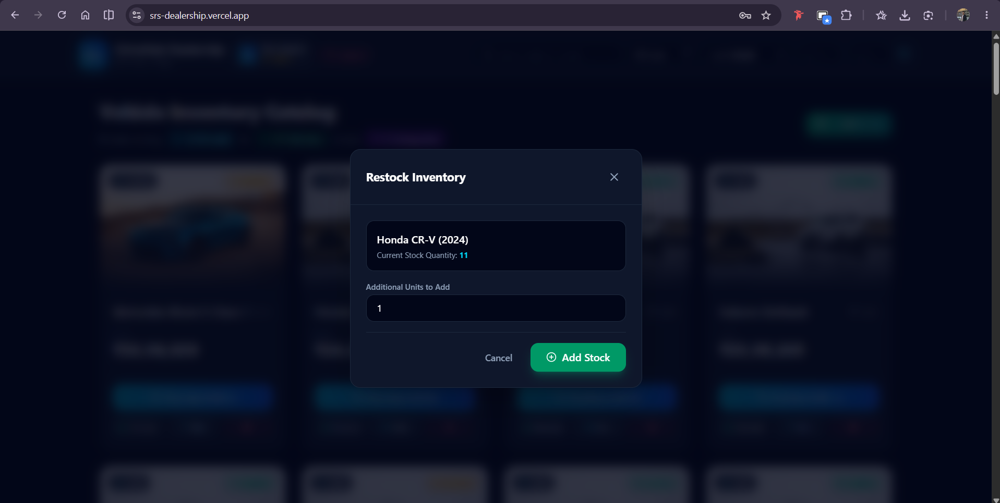 |
| **Add New Vehicle Modal** — Admin-only form (`Maker/Brand`, `Model`, `Year`, `Category`, `Price`, `Initial Stock Quantity`) that calls `POST /api/vehicles` to create a new catalog entry. | **Restock Inventory Modal** — Admin-only form showing the current stock quantity for a selected vehicle with an input for additional units, calling `POST /api/vehicles/{id}/restock`. |

---

## 🏗️ Architecture

### System Flow
```text
React SPA (Vercel)
   │
   ▼
FastAPI Backend (Render)
   │
   ▼
Neon PostgreSQL (Cloud DB)
```

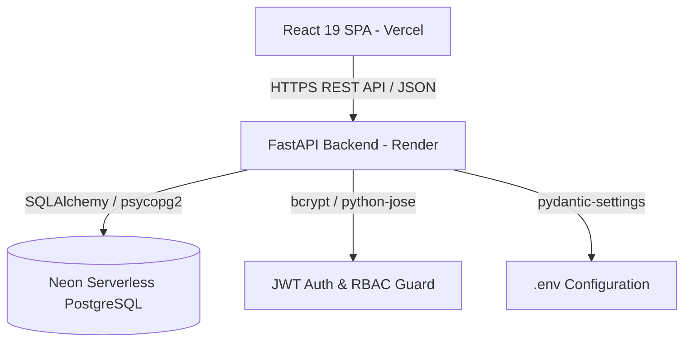

---

## 📁 Project Structure

```text
car_dealing/
├── backend/
│   ├── app/
│   │   ├── api/
│   │   │   ├── deps.py              # Auth & RBAC Dependency Injections
│   │   │   └── endpoints/         # Auth, Vehicles, Purchases Routers
│   │   ├── core/                  # Security & Config Settings
│   │   ├── db/                    # SQLAlchemy Session Builder
│   │   ├── models/                # User, Vehicle, Purchase Models
│   │   └── schemas/               # Pydantic Validation Schemas
│   ├── tests/                     # Pytest Backend Unit Test Suite
│   ├── requirements.txt
│   └── pytest.ini
├── frontend/
│   ├── src/
│   │   ├── components/            # Navbar, VehicleCard, Modals
│   │   ├── context/               # AuthContext State Provider
│   │   ├── test/                  # Vitest RTL Component Tests
│   │   └── utils/                 # Currency & Sorting Utilities
│   ├── package.json
│   └── vite.config.js
├── schema.sql                     # PostgreSQL DDL Table Schemas & CHECK Constraints
├── README.md                      # Comprehensive Project Documentation
├── IMPLEMENTATION_PLAN.md         # Architecture & TDD Execution Plan
├── PROMPTS.md                     # Chronological AI Interaction Log
├── DEVELOPMENT_LOG.docx           # Detailed Logbook & Troubleshooting
├── backend_test_report.txt        # Empirical Pytest Execution Output
├── frontend_test_report.txt       # Empirical Vitest Execution Output
└── render.yaml                    # Render Cloud Deployment Manifest
```

---

## 🗄️ Database Schema

### Entity Relationship & Schemas

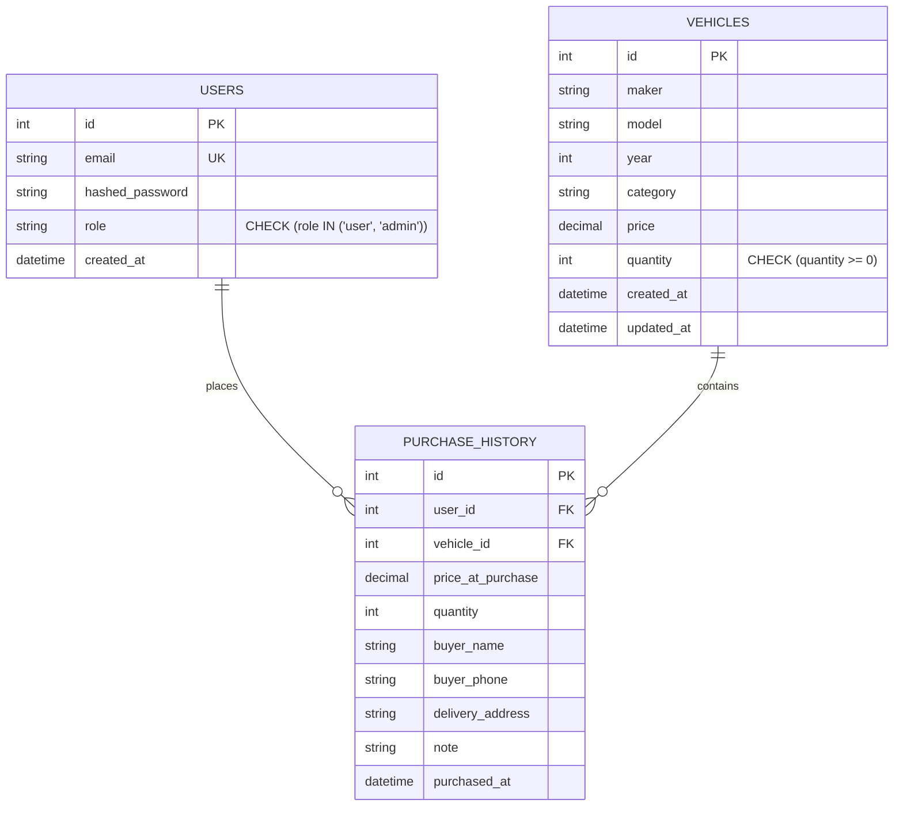

> **Deliberate Column Rename**: During domain model design, the column `make` was deliberately renamed to `maker` to provide explicit clarity across database tables, API query parameters, and frontend UI components.

---

## 🔌 API Reference Table

| Method | Endpoint | Protected | Access Role | Description |
| :--- | :--- | :---: | :--- | :--- |
| `POST` | `/api/auth/register` | No | Public | Register new user account |
| `POST` | `/api/auth/login` | No | Public | Authenticate user & return JWT token |
| `GET` | `/api/vehicles` | Yes | Customer / Admin | Retrieve full vehicle catalog |
| `GET` | `/api/vehicles/search` | Yes | Customer / Admin | Search & filter vehicles by query, category, price |
| `POST` | `/api/vehicles` | Yes | Customer / Admin | Create a new vehicle entry |
| `PUT` | `/api/vehicles/{id}` | Yes | Customer / Admin | Update vehicle details |
| `DELETE` | `/api/vehicles/{id}` | Yes | Admin Only | Delete vehicle entry from catalog |
| `POST` | `/api/vehicles/{id}/purchase` | Yes | Customer / Admin | Checkout vehicle & snapshot purchase history |
| `POST` | `/api/vehicles/{id}/restock` | Yes | Admin Only | Restock vehicle inventory stock |
| `GET` | `/api/purchases/me` | Yes | Customer / Admin | Retrieve logged-in user's purchase history |

---

## 💻 Installation & Local Setup

### Prerequisites
- **Python 3.11+**
- **Node.js 18+ & npm**

### 1. Backend Setup
```bash
cd backend
python -m venv venv
.\venv\Scripts\Activate.ps1
pip install -r requirements.txt
python -m pytest backend/tests -v > ../backend_test_report.txt
uvicorn app.main:app --reload --port 8000
```

### 2. Frontend Setup
```bash
cd frontend
npm install
npm test > ../frontend_test_report.txt
npm run dev
```

---

## 🧪 Testing & Code Coverage (37/37 Tests Passing — 93% Coverage)

The project enforces a strict **Test-Driven Development (TDD)** methodology (Red -> Green -> Refactor) across both backend and frontend layers.

```text
======================= 37 PASSED (100% Pass Rate) =======================
Backend Pytest Suite   : 21 / 21 Passed  (93% Code Coverage)
Frontend Vitest Suite  : 16 / 16 Passed  (100% Component Pass Rate)
==========================================================================
```

### Coverage Summary Table

| Module / Layer | Test File | Passed Tests | Code Coverage | Focus Areas |
| :--- | :--- | :---: | :---: | :--- |
| **Auth Module** | `backend/tests/test_auth.py` | 6 | 100% | Registration, login, duplicate email guards, password hashing |
| **Vehicles Module** | `backend/tests/test_vehicles.py` | 7 | 91% | CRUD operations, OR-based search filters, admin authorization |
| **Inventory Module** | `backend/tests/test_inventory.py` | 5 | 100% | Stock depletion, out-of-stock guards, admin restocking |
| **Purchases Module** | `backend/tests/test_purchases.py` | 3 | 95% | Checkout history creation, user isolation, 401 guards |
| **Frontend Formatters** | `frontend/src/test/currency.test.js` | 3 | 100% | INR formatting (`₹`), Lakh/Crore grouping, exchange multiplier |
| **Frontend Sorting** | `frontend/src/test/sort.test.jsx` | 4 | 100% | Client-side price & year sorting logic |
| **Frontend Layout** | `frontend/src/test/responsive.test.jsx` | 1 | 100% | Mobile drawer navigation & breakpoint rendering |
| **App Components** | `frontend/src/test/App.test.jsx` | 5 | 100% | VehicleCard stock guards, Navbar badges, Auth Required banner |
| **Purchase Checkout** | `frontend/src/test/purchase.test.jsx` | 3 | 100% | PurchaseModal submission, ProfileModal purchase history tab |

- Combined execution report saved in [`TEST_REPORT.docx`](TEST_REPORT.docx).

---

## 🚀 Cloud Deployment Architecture

| Layer | Cloud Provider | Production URL | Configuration |
| :--- | :--- | :--- | :--- |
| **Frontend SPA** | **Vercel** | [srs-dealership.vercel.app](https://srs-dealership.vercel.app) | SPA rewrite rules ([`frontend/vercel.json`](frontend/vercel.json)) |
| **Backend API** | **Render** | [drivehub-dealership.onrender.com](https://drivehub-dealership.onrender.com) | Multi-worker Gunicorn server ([`render.yaml`](render.yaml)) |
| **Database** | **Neon Cloud** | Managed PostgreSQL 16 | SSL connection pooling, DDL relational `CHECK` constraints |

---

## 🤖 AI Usage & Ownership Disclosure

### Human Direction & Conceptual Ownership (sunnyrajsu)
- **Architectural & Tech Stack Selection**: Conceptualized and selected the technology stack — FastAPI for high-performance Python microservices, PostgreSQL with relational domain `CHECK` constraints, and React 19 + Vite + Tailwind CSS for a modern single-page dashboard.
- **UI/UX Design & Aesthetic Vision**: Designed the single-page permission-gated dashboard layout (sharing one unified grid for regular users and admins, with layered admin controls), modern dark-mode aesthetic, color palette (cyan/blue gradient accents, slate dark backgrounds), and stock status pills (green "In Stock" / red "Out of Stock").
- **Implementation Strategy & Testing Process**: Designed the step-by-step TDD implementation roadmap (establishing the Red -> Green -> Refactor cycle, defining test-first boundaries for Auth, Vehicles, Inventory, and Frontend components, and setting up empirical report verification).

### Multi-AI Tool Attribution & Contributions

#### 1. Claude (Anthropic) — Planning, Architecture & Strategy
- **Role**: High-level architectural collaborator, kata requirements analysis, tech stack planning, and prompt engineering.
- **Contributions**:
  - Analyzed `TDD Kata for srs-dealership.docx` and structured the multi-phase implementation roadmap.
  - Recommended the technology stack: FastAPI microservices, PostgreSQL with domain `CHECK` constraints, and React 19 + Vite + Tailwind CSS.
  - Designed the single-page permission-gated dashboard UX rules and structured the prompt sequences provided to the in-IDE coding agent.

#### 2. Antigravity AI Agent (Google DeepMind) — Hands-On In-IDE Execution & TDD Coding
- **Role**: Primary in-IDE pair programming agent for code generation, unit test writing, and bug resolutions.
- **Contributions**:
  - Implemented backend Python microservice code (`models`, `schemas`, `endpoints`, `security`, database connection pooling).
  - Wrote TDD unit test suites (`test_auth.py`, `test_vehicles.py`, `test_inventory.py`, `test_purchases.py`) and Vitest RTL component tests (`App.test.jsx`, `currency.test.js`, `sort.test.jsx`, `responsive.test.jsx`, `purchase.test.jsx`).
  - Implemented React 19 SPA components (`Navbar`, `VehicleCard`, `FilterBar`, `AdminModal`, `RestockModal`, `AuthModal`, `ProfileModal`, `PurchaseModal`).
  - Diagnosed and resolved runtime errors (PostCSS v4 deprecation, OR-based search logic, AuthProvider context wiring, Neon DB scripts, Render `render.yaml`, Vercel `vercel.json`, secret audit history purge).

#### 3. Co-Author Trailer Attribution Standard
All AI-assisted commits retain explicit `Co-authored-by:` trailers in compliance with kata requirements. To guarantee GitHub does not misattribute AI trailers to third-party user accounts, all AI trailers use the IANA-reserved top-level domain (`.invalid`):
- `Co-authored-by: Antigravity AI <antigravity-agent@noreply.invalid>`
- `Co-authored-by: Claude AI <claude-agent@noreply.invalid>`

---

## 📑 Documentation & Deliverables

- [`DEVELOPMENT_LOG_BOOK.docx`](DEVELOPMENT_LOG_BOOK.docx): Comprehensive development logbook & engineering documentation.
- [`TEST_REPORT.docx`](TEST_REPORT.docx): Combined Pytest & Vitest empirical test execution report.
- [`PROMPTS.md`](PROMPTS.md): Complete interactive prompt logbook & Phase 8 security audit summary.
- [`schema.sql`](schema.sql): PostgreSQL DDL relational tables, foreign keys, and `CHECK` constraints.
- [`render.yaml`](render.yaml): Infrastructure-as-code deployment manifest for Render backend.
- [`frontend/vercel.json`](frontend/vercel.json): SPA routing manifest for Vercel frontend.

---

## 📄 License

This project is open-source and available under the **[MIT License](LICENSE)**.
