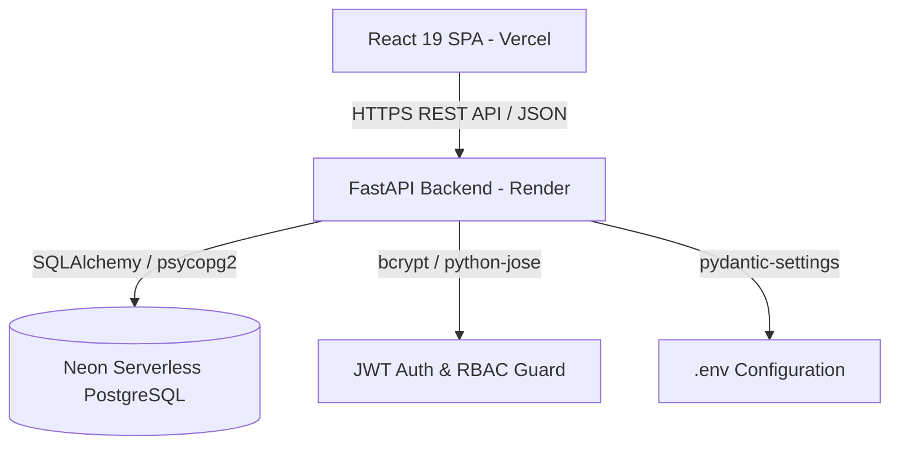
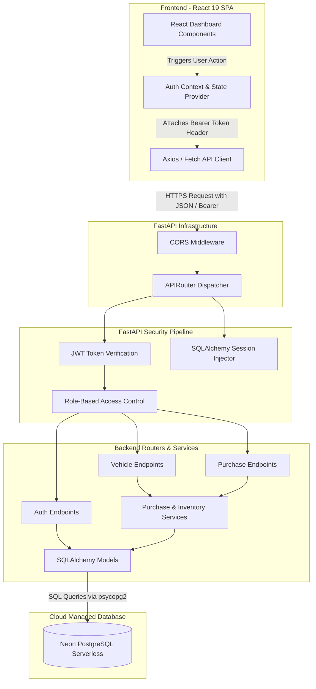
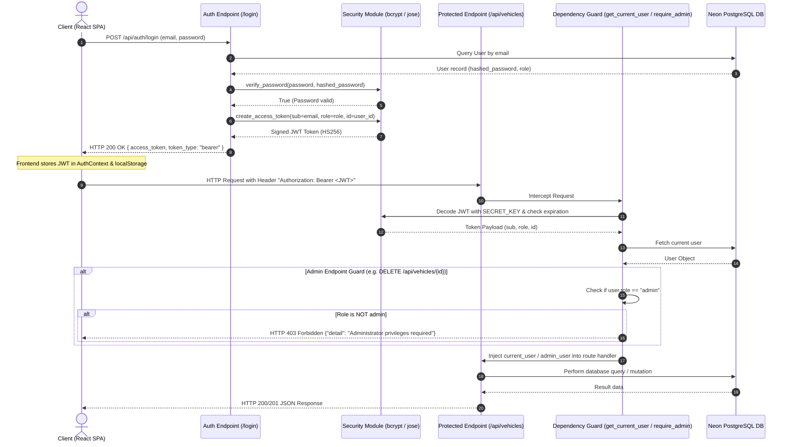
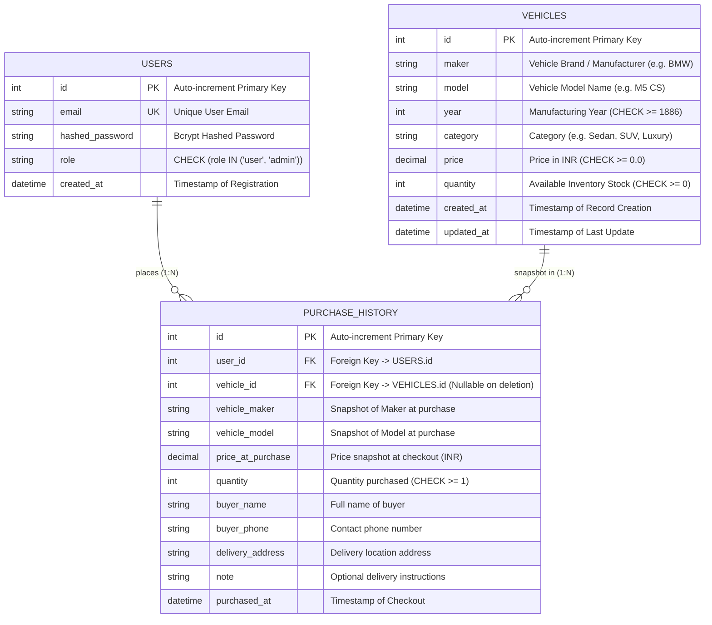

# 🚗 Car Dealership Inventory System — Interview Notes & Revision Guide

Welcome to the comprehensive technical revision guide and interview preparation notebook for the **Car Dealership Inventory System**. This document is designed for fast revision, deep-dive architectural understanding, and technical interview readiness.

---

## 📌 Executive Summary & 30-Second Elevator Pitch

### The Pitch
> "I built a production-ready, full-stack Vehicle Inventory Management & E-Commerce application using **FastAPI**, **React 19**, **PostgreSQL (Neon Cloud)**, and **JWT Authentication**, strictly following a **Test-Driven Development (TDD)** methodology with **93% backend test coverage** (37/37 total tests passing). 
>
> The system features a permission-gated single-page dashboard with role-based UI rendering (`user` vs `admin`), live search and filtering, INR currency formatting with Lakhs/Crores grouping, atomic purchase checkout with price snapshotting, and stock replenishment controls. It is deployed live on **Vercel** (Frontend) and **Render** (Backend API)."

### 🔗 Live URLs & Credentials
- **Live Application:** [srs-dealership.vercel.app](https://srs-dealership.vercel.app)
- **Backend API:** [drivehub-dealership.onrender.com](https://drivehub-dealership.onrender.com)
- **Admin Demo Credentials:** `admin@dealership.com` / `admin123`
- **Customer Demo Credentials:** `user@dealership.com` / `user123`

---

## 🏛️ Comprehensive System Architecture & Diagrams

### 1. High-Level Architecture
```text
┌───────────────────────────┐      HTTPS / REST / JSON      ┌──────────────────────────┐      SQLAlchemy / psycopg2      ┌──────────────────────────────┐
│  React 19 SPA (Vercel)   │ ────────────────────────────► │  FastAPI Backend (Render)│ ─────────────────────────────► │ Neon PostgreSQL (Cloud DB)   │
└───────────────────────────┘                               └──────────────────────────┘                               └──────────────────────────────┘
```



---

### 2. 🔄 System Data Flow Diagram
This diagram traces the full lifecycle of a user request from frontend state changes to backend security verification and database persistence:



---

### 3. 🗺️ User Flow & Journey Diagram
This flowchart depicts the dual-role user journeys for both regular customers and system administrators:

```mermaid
flowchart TD
    Start([User visits Application]) --> CheckAuth{Is Authenticated?}
    
    %% Unauthenticated Flow
    CheckAuth -- No --> GuestView[Locked Dashboard Banner]
    GuestView --> OpenAuthModal[Click Login / Register]
    OpenAuthModal --> SubmitAuthForm{Submit Credentials}
    SubmitAuthForm -- Validation Fail --> AuthError[Show Error Notification]
    AuthError --> OpenAuthModal
    SubmitAuthForm -- Success --> IssueJWT[Store JWT & Update AuthContext State]
    IssueJWT --> CheckRole

    %% Authenticated Flow
    CheckAuth -- Yes --> CheckRole{User Role?}

    %% Customer Journey
    CheckRole -- Customer (role: user) --> CustomerDash[Customer Catalog View]
    CustomerDash --> SearchFilter[Use Search & Category Filter Bar]
    SearchFilter --> ViewCards[Browse Vehicle Cards & Prices]
    ViewCards --> ClickBuy{Click Purchase Vehicle}
    ClickBuy --> PurchaseModal[Fill Checkout Form: Name, Phone, Address, Quantity]
    PurchaseModal --> SubmitPurchase[POST /api/vehicles/{id}/purchase]
    SubmitPurchase -- Out of Stock / Invalid --> PurchaseErr[Show Error Notification]
    SubmitPurchase -- Success --> StockDecremented[Stock Decremented & Purchase Snapshot Saved]
    StockDecremented --> ViewHistory[View Order in Profile Purchase History Tab]

    %% Admin Journey
    CheckRole -- Administrator (role: admin) --> AdminDash[Admin Catalog View with Elevated Controls]
    AdminDash --> ToggleView{Select Action}
    ToggleView -- Add Vehicle --> AddModal[+ Add New Vehicle Modal] --> POST_Vehicle[POST /api/vehicles]
    ToggleView -- Manage Inventory --> InventoryGroup[Brand-Grouped Inventory View]
    InventoryGroup --> RestockAction[Click Restock] --> RestockModal[Restock Quantity Form] --> POST_Restock[POST /api/vehicles/{id}/restock]
    InventoryGroup --> EditAction[Click Edit] --> EditModal[Edit Vehicle Details Form] --> PUT_Vehicle[PUT /api/vehicles/{id}]
    InventoryGroup --> DeleteAction[Click Delete] --> DeleteConfirm[Delete Confirmation Prompt] --> DEL_Vehicle[DELETE /api/vehicles/{id}]
    
    POST_Vehicle & POST_Restock & PUT_Vehicle & DEL_Vehicle --> UpdateUI[Live Catalog Refresh & State Re-render]
```

---

### 4. 🔐 JWT Authentication & RBAC Sequence Diagram



---

### 5. 🗄️ Database Entity Relationship Diagram (ERD)



---

## 💻 Frontend Deep-Dive (React 19 + Tailwind CSS)

### Core Stack & Architecture
- **Framework:** React 19 SPA bootstrapped with Vite.
- **Styling:** Custom Tailwind CSS dark theme featuring glassmorphism cards, cyan/blue gradient accents (`#06b6d4`, `#3b82f6`), and responsive grid breakpoints (`grid-cols-1 md:grid-cols-2 lg:grid-cols-3`).
- **State Provider:** `AuthContext` managing authentication tokens, current user profile, role permissions (`user` vs `admin`), and modal visibility.

### Component Structure
```text
src/
├── components/
│   ├── Navbar.jsx           # Global nav bar with brand, mobile menu trigger, user profile pill
│   ├── MobileNavMenu.jsx    # Responsive drawer menu for mobile viewports
│   ├── VehicleCard.jsx      # Catalog vehicle display card with dynamic role-based controls
│   ├── FilterBar.jsx        # Search input, Category dropdown, and Sort options
│   ├── AuthModal.jsx        # Login & Register modal form
│   ├── ProfileModal.jsx     # User details & Purchase History tab view
│   ├── PurchaseModal.jsx    # Interactive checkout modal with quantity selector & address input
│   ├── AdminModal.jsx       # Add/Edit vehicle form modal for administrators
│   └── RestockModal.jsx     # Admin stock replenishment modal
├── context/
│   └── AuthContext.jsx      # Global auth state, localStorage sync, login/logout functions
├── utils/
│   ├── currency.js          # INR formatting (Intl.NumberFormat('en-IN'))
│   └── sort.js              # Client-side vehicle sorting (price, year, model)
└── test/
    ├── App.test.jsx         # RTL component tests for catalog rendering & stock guards
    ├── currency.test.js     # Vitest tests for currency formatting
    ├── purchase.test.jsx    # Vitest tests for purchase checkout modal
    ├── responsive.test.jsx  # Responsive drawer tests
    └── sort.test.jsx        # Sorting logic tests
```

### Key Frontend Capabilities
1. **Dynamic Role-Gated UI**: Single-page dashboard conditionally renders actions based on `user.role`:
   - `user`: Views vehicle catalog, searches/filters, purchases vehicles, views personal purchase history.
   - `admin`: Elevated view with `+ Add Vehicle` button, brand-grouped `Manage Inventory` view, and per-card `Edit`, `Restock`, `Delete` actions.
2. **INR Currency Formatting (`currency.js`)**:
   ```javascript
   export const formatINR = (amount) => {
     return new Intl.NumberFormat('en-IN', {
       style: 'currency',
       currency: 'INR',
       maximumFractionDigits: 0
     }).format(amount);
   };
   ```
3. **Out-of-Stock Guard**:
   - Vehicles with `quantity === 0` render a red `"Out of Stock"` badge and grey out the **Purchase Vehicle** button (`disabled={quantity === 0}`).

---

## ⚡ Backend Deep-Dive (FastAPI + SQLAlchemy + PostgreSQL)

### Core Stack & Architecture
- **Framework:** FastAPI (Python 3.13) with ASGI Uvicorn server.
- **ORM & DB:** SQLAlchemy 2.0 with `psycopg2` driver connecting to Neon Serverless PostgreSQL.
- **Data Validation:** Pydantic v2 schemas (`VehicleCreate`, `VehicleUpdate`, `UserCreate`, `PurchaseCreate`).
- **Dependency Injection (`deps.py`)**:
  - `get_db`: Yields database sessions with automatic closure.
  - `get_current_user`: Decodes JWT header, validates token expiration, and loads user model.
  - `require_admin`: Enforces `current_user.role == "admin"`.

### Key Backend Services & Logic
1. **Purchase Transaction Service (`app/services/purchase.py`)**:
   - Performs stock verification (`vehicle.quantity >= quantity`).
   - Decrements stock atomically: `vehicle.quantity -= quantity`.
   - Snapshots purchase history (`price_at_purchase = vehicle.price`, `vehicle_maker`, `vehicle_model`).
   - Commits transaction to database.
2. **Restock Service (`app/api/endpoints/vehicles.py`)**:
   - Admin-only route (`POST /api/vehicles/{id}/restock?amount=N`).
   - Increments inventory quantity: `vehicle.quantity += amount`.
3. **Database-Level CHECK Constraints (`schema.sql`)**:
   - `quantity >= 0` (Prevents negative inventory in database).
   - `year >= 1886` (Earliest automobile manufacturing year).
   - `price >= 0.0` (Non-negative pricing).
   - `role IN ('user', 'admin')` (Role validation).

---

## 🔐 Security & Authentication Deep-Dive

1. **Password Hashing**: Encrypted using **`bcrypt`** via `passlib.context.CryptContext`. Plaintext passwords are never logged or stored.
2. **JWT Token Generation (`HS256`)**:
   - Uses `python-jose` library.
   - Signed with `SECRET_KEY` and configurable expiration time (`ACCESS_TOKEN_EXPIRE_MINUTES`).
   - Payload structure: `{ "sub": "email", "role": "user|admin", "id": int, "exp": epoch }`.
3. **Token Transmission**: Passed via HTTP Header: `Authorization: Bearer <token>`.
4. **Secret Protection**: Automated pre-commit git scanner hooks preventing API key exposure.

---

## 🔌 API Reference & Endpoints Calling Guide

| Method | Endpoint | Protected | Access Role | Description |
| :--- | :--- | :---: | :--- | :--- |
| `GET` | `/` | No | Public | Backend operational health check |
| `POST` | `/api/auth/register` | No | Public | Register new user account |
| `POST` | `/api/auth/login` | No | Public | Authenticate user & return JWT token |
| `GET` | `/api/vehicles` | Yes | Customer / Admin | Retrieve full vehicle catalog |
| `GET` | `/api/vehicles/search` | Yes | Customer / Admin | Search & filter vehicles by query, category, price |
| `POST` | `/api/vehicles` | Yes | Customer / Admin | Create a new vehicle entry |
| `PUT` | `/api/vehicles/{id}` | Yes | Customer / Admin | Update vehicle details |
| `DELETE` | `/api/vehicles/{id}` | Yes | Admin Only | Delete vehicle entry from catalog |
| `POST` | `/api/vehicles/{id}/purchase` | Yes | Customer / Admin | Checkout vehicle & snapshot purchase history |
| `POST` | `/api/vehicles/{id}/restock` | Yes | Admin Only | Restock vehicle inventory stock |
| `GET` | `/api/purchases/me` | Yes | Customer / Admin | Retrieve logged-in user's purchase history |

---

### Detailed Endpoint Specifications & JSON Schemas

#### 1. `POST /api/auth/register`
- **Request Body (`UserCreate`):**
  ```json
  { "email": "user@dealership.com", "password": "user123", "role": "user" }
  ```
- **Response `201 Created` (`UserResponse`):**
  ```json
  { "id": 1, "email": "user@dealership.com", "role": "user", "created_at": "2026-08-06T12:00:00Z" }
  ```

#### 2. `POST /api/auth/login`
- **Request Body (`LoginRequest`):**
  ```json
  { "email": "user@dealership.com", "password": "user123" }
  ```
- **Response `200 OK` (`Token`):**
  ```json
  { "access_token": "eyJhbGciOiJIUzI1...", "token_type": "bearer" }
  ```

#### 3. `GET /api/vehicles/search`
- **Query Params:** `q`, `maker`, `model`, `category`, `min_price`, `max_price`.
- **Response `200 OK`:** Array of vehicle objects matching all criteria.

#### 4. `POST /api/vehicles/{id}/purchase`
- **Header:** `Authorization: Bearer <token>`
- **Request Body (`PurchaseCreate`):**
  ```json
  {
    "buyer_name": "Sunny Raj",
    "buyer_phone": "+91 9876543210",
    "delivery_address": "123 Tech Park, Bangalore",
    "note": "Handle with care",
    "quantity": 1
  }
  ```
- **Response `200 OK` (`PurchaseResponse`):**
  ```json
  {
    "id": 10,
    "user_id": 2,
    "vehicle_id": 1,
    "vehicle_maker": "BMW",
    "vehicle_model": "M5 CS",
    "quantity": 1,
    "price_at_purchase": 18500000.0,
    "buyer_name": "Sunny Raj",
    "buyer_phone": "+91 9876543210",
    "delivery_address": "123 Tech Park, Bangalore",
    "note": "Handle with care",
    "purchased_at": "2026-08-06T15:00:00Z"
  }
  ```

#### 5. `POST /api/vehicles/{id}/restock` (Admin Only)
- **Header:** `Authorization: Bearer <ADMIN_TOKEN>`
- **Query Param:** `amount=5`
- **Response `200 OK`:** Updated vehicle object with `quantity: quantity + amount`.

---

## 🎯 Technical Interview Q&A & Talking Points

### Q1: Why did you choose FastAPI over Flask or Django?
> **Answer:** FastAPI offers high performance comparable to NodeJS and Go, thanks to Starlette and ASGI asynchronous concurrency. Additionally, FastAPI automatically performs request validation using Pydantic schemas, auto-generates interactive Swagger/OpenAPI documentation (`/docs`), and leverages Python type hints for fast developer iteration.

### Q2: How do you handle concurrency and stock depletion guards during vehicle purchases?
> **Answer:** Stock protection is handled at three distinct layers:
> 1. **Database Layer:** A PostgreSQL `CHECK (quantity >= 0)` constraint guarantees negative inventory cannot be written to disk.
> 2. **Application/Service Layer:** The `create_purchase_record` service checks available stock (`vehicle.quantity >= quantity`) and raises `HTTP 400 Bad Request` if stock is insufficient before calling `db.commit()`.
> 3. **UI/Frontend Layer:** Vehicle cards render out-of-stock badges and grey out the purchase action button when `quantity == 0`.

### Q3: How is Role-Based Access Control (RBAC) enforced across frontend and backend?
> **Answer:**
> - **Backend:** JWT payload embeds the user's role (`user` or `admin`). FastAPI uses a custom dependency injection guard `require_admin` which decodes the token and verifies `user.role == "admin"`. Non-admins calling admin endpoints receive `HTTP 403 Forbidden`.
> - **Frontend:** The `AuthContext` provides `user.role` across components. Buttons like `+ Add Vehicle`, `Edit`, `Restock`, and `Delete` are conditionally rendered only when `user.role === 'admin'`.

### Q4: Why did you rename the `make` column to `maker`?
> **Answer:** `make` is a reserved keyword or built-in concept in several programming contexts (e.g. GNU `make`, Python build tools). Renaming it to `maker` eliminated syntax ambiguities across database schema definitions, SQLAlchemy models, Pydantic schemas, API query parameters (`GET /api/vehicles/search?maker=BMW`), and React UI component props.

### Q5: How did you implement Test-Driven Development (TDD) in this project?
> **Answer:** I followed a strict **Red -> Green -> Refactor** TDD cycle:
> 1. **Red:** Wrote failing Pytest unit tests (`test_auth.py`, `test_vehicles.py`, `test_inventory.py`, `test_purchases.py`) and Vitest RTL component tests (`App.test.jsx`, `currency.test.js`, `sort.test.jsx`, `purchase.test.jsx`) *before* writing production code.
> 2. **Green:** Implemented minimal backend endpoints and frontend components to pass the test assertions.
> 3. **Refactor:** Cleaned up code structure, dependency injections, and CSS glassmorphism styling while keeping tests 100% passing.
> Resulted in **37/37 tests passing** and **93% backend code coverage**.

### Q6: How does price snapshotting work in the purchase history module?
> **Answer:** Vehicle prices can change over time due to restocks or market updates. To preserve historical purchase accuracy, when a user purchases a vehicle, the service snapshots `price_at_purchase = vehicle.price` as well as `vehicle_maker` and `vehicle_model` into the `purchase_history` table. If the vehicle price is updated later or the vehicle is deleted, the customer's historical receipt remains completely accurate and intact.

### Q7: How are cloud deployments managed on Vercel and Render?
> **Answer:**
> - **Frontend (Vercel):** Deployed as a Vite SPA with rewrite rules in [`vercel.json`](frontend/vercel.json) routing all incoming paths to `index.html` for client-side React routing.
> - **Backend (Render):** Deployed as a Gunicorn/Uvicorn ASGI Python service using [`render.yaml`](render.yaml) infrastructure manifest, connecting to a Neon Serverless PostgreSQL instance via SSL pooling.
